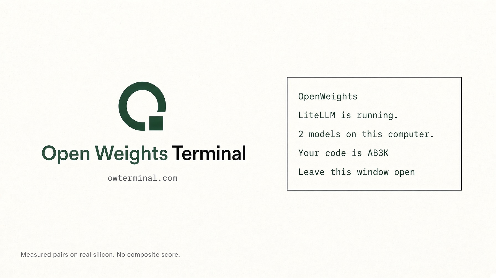

# ow



`ow` puts the models on your computer into the [OpenWeights](https://owterminal.com) pool. It finds the local model server you already run, registers its models, then stays open and takes jobs.

It does not install Python, a model, or a GPU stack. It is one file, with no dependencies.

The same steps, with copy buttons, are on [owterminal.com/inference?door=host](https://owterminal.com/inference?door=host).

## Install

macOS, Linux, or Windows with WSL. Node 22 or newer. A model server already running on this computer.

```sh
curl -fsSL https://raw.githubusercontent.com/dvidia-inference/ow/main/install.sh | sh
export PATH="$HOME/.ow:$PATH"
ow models
```

The same installer is on the site: `curl -fsSL https://owterminal.com/ow-install.sh | sh`

Both download the current `ow.mjs` from owterminal.com, check it parses, and save it to `~/.ow`.

## Your model server

`ow` talks to any local server with an OpenAI-style `/v1` API. Point `LITELLM_BASE` at it. The name is historical; it is not only for LiteLLM.

| Server | `LITELLM_BASE` |
|---|---|
| LiteLLM | `http://127.0.0.1:4000` (the default) |
| Ollama | `http://127.0.0.1:11434` |
| LM Studio | `http://127.0.0.1:1234` |
| llama.cpp `llama-server` | `http://127.0.0.1:8080` |
| vLLM | `http://127.0.0.1:8000` |

A trailing `/v1` is fine. If the server wants a key, set `LITELLM_KEY`. It is sent only to your server.

## What the first run does

```sh
ow
```

1. It asks your server which models it has. It waits two seconds.
2. It registers each new model and prints its public node code.
3. It stays open and takes jobs. Leave the window open.

Run it again and it prints the same codes. It does not register a model twice.

While it is open, `ow`:

- reads the model list every minute, and registers new ones
- times each model with a short "hi" every five minutes
- runs a pool test, and renews it every 12 hours
- asks for work every two seconds

The bottom line says `waiting`, `working`, `done`, `failed`, or `busy    GPU is full`.

In another terminal, `ow status` says `READY` once the pool test passes. `ow link` prints a one-time code. Enter it at [owterminal.com/account/machines](https://owterminal.com/account/machines) within 10 minutes to link this machine to your account.

Stop with Ctrl+C. The pool marks the machine offline after three minutes without contact. `ow serve` resumes with the same keys.

## Commands

```
ow                 look at this computer, join, then stay open
ow models          list the local server's models, without joining
ow join            register the models, then stop
ow serve           stay open and take jobs, if already registered
ow status          read pool readiness
ow link            get a one-time account pairing code
ow check           request a pool test
ow check status    read the pool test result
```

The site's flow is `ow models`, then `ow join && ow serve`.

## Knobs

Set these before `ow`, in the same terminal.

| | Default | |
|---|---|---|
| `LITELLM_BASE` | `http://127.0.0.1:4000` | Your model server. |
| `LITELLM_KEY` | empty | Only if your server asks for a key. |
| `OW_MODELS` | every model | Exact model IDs, comma separated. Up to 24. |
| `OW_PRICE` | suggested | Cents per million tokens, 1 to 5000. `150` is $1.50. |
| `OW_PRICES` | empty | Per-model prices as JSON: `'{"qwen2.5:7b":100}'`. |
| `OW_SLOTS` | `1` | Jobs at once, 1 to 8. For servers that batch, like vLLM or `llama-server`. |
| `POOL_URL` | `https://owterminal.com` | The desk. |
| `OW_HOME` | `~/.ow` | Where the keys are saved. |

```sh
OW_MODELS=qwen2.5:7b OW_PRICE=150 ow
```

Without `OW_PRICE`, the desk suggests a price for each model and `ow join` prints it. Prices apply when a model is first registered. A model already registered keeps its price.

Leave `OW_WAIT` and `OW_RELAY` unset. Held claims are off by default, and the relay is present but not enabled yet.

## Keys

`~/.ow` holds two key files. Both are private to your user (`600`). Do not paste them anywhere.

- `nodes.json`: one secret per model. The secret is how the desk knows this machine.
- `enckey.json`: an X25519 key pair for sealed prompts.

Some prompts arrive sealed. On first join, `ow` makes the key pair and sends the desk only the public half. A sealed prompt is decrypted with the private key, in memory, only while its job runs. It is not written to disk. This machine still sees the prompt, because it has to run it. If a prompt does not decrypt, the job is reported failed.

Back up `~/.ow`. If you lose `nodes.json`, the next run registers the models again with new codes.

## What it sends

To the desk: each model's ID, the GPU name and memory (from `nvidia-smi`, or the Apple chip name on a Mac), a measured speed, whether it is busy, the slot count, the public key, and each job's output and token counts.

To your server: the jobs, as chat completions.

The node secrets go only to the desk. `LITELLM_KEY` goes only to your server. The wire format is in [PROTOCOL.md](PROTOCOL.md).

## When it stops

| What you see | What to do |
|---|---|
| LiteLLM is not running on this computer. | Start your model server. If it is not on port 4000, set `LITELLM_BASE`. |
| LiteLLM is running, but the password was refused. | Set `LITELLM_KEY`. |
| It has no models loaded. | Load a model, then run `ow` again. |
| `fetch failed` | Nothing answered. Check that your model server is up at `LITELLM_BASE` and that this computer can reach owterminal.com. |
| A selected OW_MODELS ID is missing from this server. | Run `ow models` without `OW_MODELS` and copy the exact IDs. |
| Choose up to 24 models with OW_MODELS. | List the ones to share in `OW_MODELS`. |
| OW_PRICE must be integer cents from 1 to 5000. | Use whole cents. `150`, not `1.50`. |
| OW_PRICES rates must be integer cents from 1 to 5000. | Same rule, inside the JSON. |
| Already open in another window. / This worker is already running. | Use that window. Do not start a second one. |
| Nothing joined. Run: ow join | Run `ow join` first. |
| Could not read saved host keys. | Restore `~/.ow/nodes.json` from a backup. Do not delete it. |
| Could not read the saved encryption key. | Restore `~/.ow/enckey.json` from a backup. |
| `busy    GPU is full` | `nvidia-smi` shows more than 92% of GPU memory in use. `ow` takes no jobs until it drops. Servers that reserve memory up front can trip this. |
| `ow status` stays on `CHECKING` | Keep `ow serve` open. Read the result with `ow check status`. Tests run at most once every 10 minutes. |
| Node.js 22 or newer is required. | Install Node 22 from [nodejs.org](https://nodejs.org/en/download), then run the installer again. |

## Where it sits

```
this computer
  model server     LiteLLM, Ollama, LM Studio, llama.cpp, vLLM
  ow               looks, joins, stays open
        |
        v
owterminal.com     the desk. the code, the price, the jobs
```

Do not point your model server back at owterminal.com. `ow` calls your server. Your server must not call the pool.

Two computers, each with its own server, each run their own `ow`.

## Updating

Run the installer again, then restart `ow serve`. It replaces `~/.ow/ow.mjs` and keeps your keys. Changes are in [CHANGELOG.md](CHANGELOG.md).

## License

[MIT](LICENSE)
